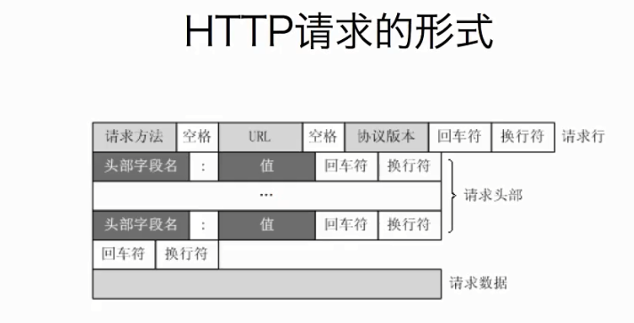
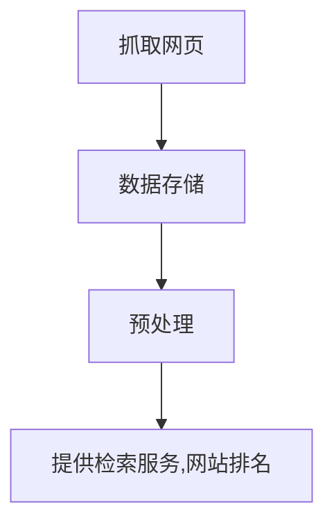
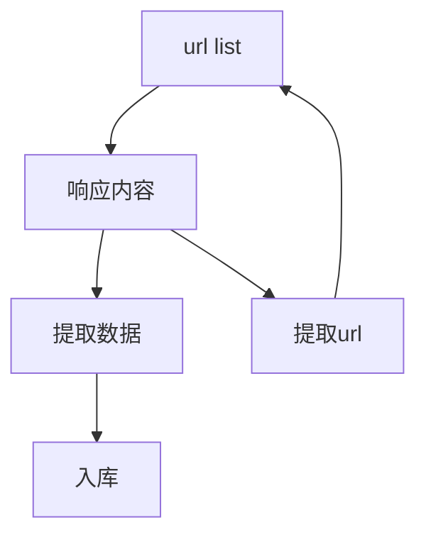
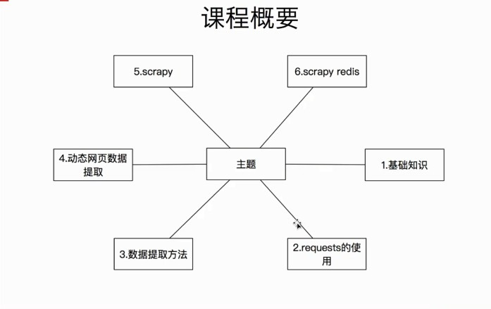
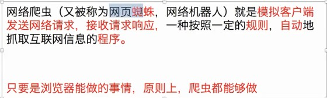
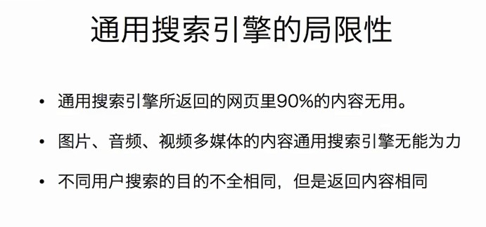
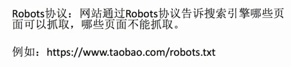
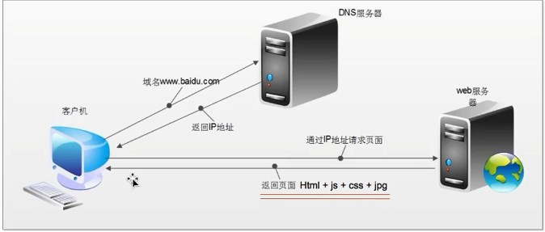

#目录
<!-- TOC depthFrom:1 depthTo:6 withLinks:1 updateOnSave:1 orderedList:0 -->

- [目录](#目录)
- [1.字符换知识点](#1字符换知识点)
	- [1.1 str与bytes转换](#11-str与bytes转换)
- [2.HTTP与HTTPS知识](#2http与https知识)
	- [2.1 HTTP:](#21-http)
	- [2.2 HTTPS:](#22-https)
- [3.爬虫简介](#3爬虫简介)
	- [3.1url:](#31url)
	- [3.2 爬虫的概念：](#32-爬虫的概念)
	- [3.3 爬虫的流程：](#33-爬虫的流程)
- [4.URL格式和http请求格式](#4url格式和http请求格式)
	- [4.1 URL的形式](#41-url的形式)
	- [4.2 http请求的形式](#42-http请求的形式)
	- [4.3 http请求头](#43-http请求头)
	- [4.4 常见的请求方法](#44-常见的请求方法)
	- [4.5 状态码](#45-状态码)
	- [4.6 PS](#46-ps)
- [5.爬虫的流程](#5爬虫的流程)
	- [5.1 爬虫的分类](#51-爬虫的分类)
	- [5.2 聚焦爬虫和通用爬虫的工作流程](#52-聚焦爬虫和通用爬虫的工作流程)
- [6.爬虫基础知识](#6爬虫基础知识)
	- [6.1 学习概要](#61-学习概要)
	- [6.2数据来源](#62数据来源)
	- [6.3 爬虫的定义](#63-爬虫的定义)
	- [6.4 爬虫的作用](#64-爬虫的作用)
- [7.搜索引擎的工作原理及robots协议](#7搜索引擎的工作原理及robots协议)
	- [7.1 通用搜索引擎的局限性](#71-通用搜索引擎的局限性)
	- [7.2 robots协议](#72-robots协议)
- [8.浏览器发送请求的过程](#8浏览器发送请求的过程)
	- [8.1 服务器访问url地址过程](#81-服务器访问url地址过程)
	- [8.2 为什么要DNS?](#82-为什么要dns)
	- [8.3 ps](#83-ps)
	- [8.4 页面上的数据在哪里？](#84-页面上的数据在哪里)

<!-- /TOC -->
---
#1.字符换知识点
---
##1.1 str与bytes转换
- str 用 encode 转换为 bytes
- bytes 用 decode 转换为 str
- 编解码方式要一一致，否则会出现乱码，默认为utf-8
- gbk：包含全部中日韩汉字，并包含了BIG5编码中的所有汉字，用双字节形式编码
-  例如:
``` python
a='捡回'  
b=a.endcode('gbk')  
b.decode('gbk')  
```
---
#2.HTTP与HTTPS知识
---
## 2.1 HTTP:  
　　1.超文本传输协议  
　　2.默认端口号：80
---
## 2.2 HTTPS:  
　　１.HTTP + SSL(安全套接字层)  
　　２.默认端口号：443  
---
# 3.爬虫简介
---
##3.1url:
- 是统一资源定位符，对可以从互联网上得到的资源的位置和访问方法的一种简洁的表示，是互联网上标准资源的地址。互联网上的每个文件都有一个唯一的URL，它包含的信息指出文件的位置以及浏览器应该怎么处理它。

##3.2 爬虫的概念：
- 模拟浏览器发送请求，获取响应
- ---

##3.3 爬虫的流程：
- url->发送请求，获取响应->提取数据->保存  
　　　　　　　　　　　    ->提取url
---
#4.URL格式和http请求格式
---
##4.1 URL的形式
- 形式：  
　　scheme://host[:post#]/path/.../[?query-string][#anchor]  

- 解析：  
　　scheme:协议（例如：http,https,ftp）  
　　port:服务器的IP地址或域名  
　　path:访问资源的路径  
　　query-string:参数，发送给http的数据  
　　anchor:锚(跳转到网页的指定锚点位置)  
　　http://localhost:4000/file/part01/1.2.html  
　　http://item.jd.con/11936238.html#product-detail  
- URL地址中带不带锚点响应是一样的
---
##4.2 http请求的形式


---  
##4.3 http请求头
- 网页中F12->Network->选择网站名->Headers->Request Headers->view parsed  

例如：  
　　百度的http请求格式为：  
**GET / HTTP/1.1**  
**Host**: www.baidu.com  
**Connection**: keep-alive  
**Cache-Control**: max-age=0  
**Upgrade-Insecure-Requests**: 1  
**User-Agent**: Mozilla/5.0 (Windows NT 6.1; Win64; x64) AppleWebKit/537.36 (KHTML, like Gecko) Chrome/75.0.3770.100 Safari/537.36  
**Accept**: text/html,application/xhtml+xml,application/xml;q=0.9,image/  webp,image/apng,*/*;q=0.8,application/signed-exchange;v=b3  
**Accept-Encoding**: gzip, deflate, br  
**Accept-Language**: zh-CN,zh;q=0.9  
**Cookie**: BIDUPSID=B3223FC96947B3C7180A6141C57C9895; PSTM=1506247459;    BD_UPN=12314353; BAIDUID=C2A22FC693A256DF655205196FE34C2B:FG=1; MCITY=-340%3A; delPer=0; BD_CK_SAM=1; PSINO=1; BD_HOME=0;COOKIE_SESSION=11_0_7_4_11_7_0_1_6_4_0_0_6527_0_16_0_1564570397_0_1564570381%7C9%2370447_48_1564024573%7C9; BDORZ=FFFB88E999055A3F8A630C64834BD6D0; H_PS_PSSID=1433_21103_29522_29521_28519_29098_29567_28838_29221_26350_29071

GET:请求类型   
host:域名（主机和端口号）  
Connection:连接类型,此处为保持连接  
*User-Agent:用户代理，浏览器标识。网站通过它了解当前操作来源。也可以通过它伪装成其它设备。  
Upgrade-Insecure-Requests：将http请求升级为https（1的话）  
Accep：本机可以接收的类型  
Accept-Encoding：可接受的数据压缩方式（编解码形式）
Accept-Language：愿意接受数据（语言）  
ps：所有Accept中q都代表权重，即更愿意接受的类型  
*Cookie:即保存在本地浏览器的数据，也是Cookie选项中Request Cookies的name和value两值的组合。  
*setson（大概）*：保存在网站服务器的数据  
Referer：（页面跳转处）即从哪里跳转过来的  
x-requested-with:XMLHttpRequest（是Ajax异步请求）

---
##4.4 常见的请求方法  
- GET:  
　　一般都会使用  

- POST:  
　　传输表格、图片和大文本时使用
---
##4.5 状态码
- 200：成功
- 302：临时转移到新的url
- 307：同上
- 404：not found
- 500：服务器内部错误
---
##4.6 PS
- 浏览器渲染的页面和爬虫请求的页面并不一样
---
#5.爬虫的流程
---
##5.1 爬虫的分类
- 通用爬虫：通常指搜索引擎的爬虫
- 聚焦爬虫：针对特定网站的爬虫
---
##5.2 聚焦爬虫和通用爬虫的工作流程
- 搜索引擎流程（通用爬虫）：


- 聚焦爬虫流程：

---
#6.爬虫基础知识
---
##6.1 学习概要


---
##6.2数据来源
- 数据收集网站
- 官方数据网站
- 第三方数据网站
---
##6.3 爬虫的定义


---
##6.4 爬虫的作用
- 爬取数据
- 抢票
- 短信轰炸
- 网站投票
---
#7.搜索引擎的工作原理及robots协议
---
##7.1 通用搜索引擎的局限性


---
##7.2 robots协议



---
#8.浏览器发送请求的过程
---
##8.1 服务器访问url地址过程

---
##8.2 为什么要DNS?
- DNS可以将域名转化为对应的ip地址然后实现请求界面。
---
##8.3 ps
- 爬虫要根据当前url地址对应的响应为准，当前url地址的elements的内容和url的响应不一样
---
##8.4 页面上的数据在哪里？
- 当前rul地址对应的响应中
- 其他url地址对应的响应中
  - 比如ajax请求中。
- js生成的
  - 部分数据在响应中
  - 全部通过js生成
