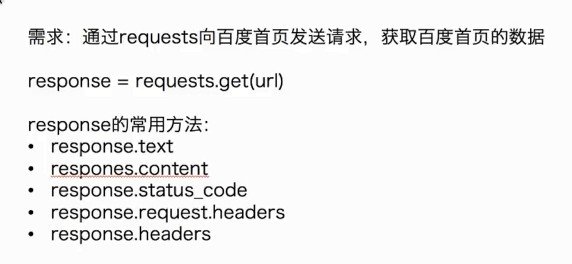
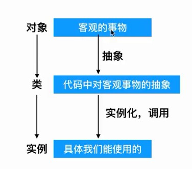
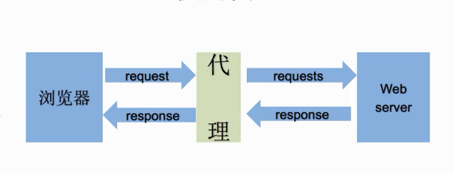
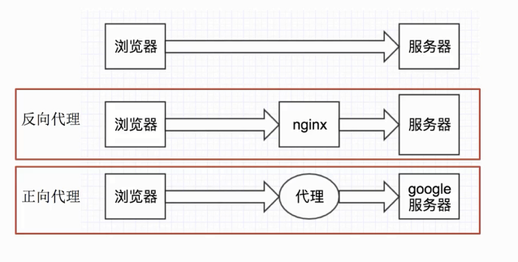

 # 目录
<!-- TOC depthFrom:1 depthTo:6 withLinks:1 updateOnSave:1 orderedList:0 -->

- [1.requests模块发送headers的请求和带参数的请求](#1requests模块发送headers的请求和带参数的请求)
	- [1.1 发送简单的请求](#11-发送简单的请求)
	- [1.2 判断请求是否成功](#12-判断请求是否成功)
	- [1.3 user-agent](#13-user-agent)
	- [1.4 爬取源代码](#14-爬取源代码)
	- [1.5 带参数的请求](#15-带参数的请求)
	- [1.6 url地址中会带有乱码](#16-url地址中会带有乱码)
	- [1.7 字符串格式化的另一种方式](#17-字符串格式化的另一种方式)
	- [1.8 爬虫返回数据类型](#18-爬虫返回数据类型)
- [2.贴吧爬虫](#2贴吧爬虫)
	- [2.1 关于对象](#21-关于对象)
	- [2.2 推导式](#22-推导式)
- [3.发送post请求](#3发送post请求)
	- [3.1用处](#31用处)
	- [3.2用法](#32用法)
- [4.使用代理](#4使用代理)
	- [4.1代理流程](#41代理流程)
	- [4.2代理形式](#42代理形式)
	- [4.3使用方法](#43使用方法)
	- [4.4使用原因](#44使用原因)
	- [4.5检查可用性](#45检查可用性)
- [5模拟登陆的三种方式](#5模拟登陆的三种方式)
	- [5.1cookie 和 session的区别](#51cookie-和-session的区别)
	- [5.2带上cookie和session的好处and弊端](#52带上cookie和session的好处and弊端)
	- [5.3session实现客户端和服务端的会话保留](#53session实现客户端和服务端的会话保留)
	- [5.4请求登陆后才可访问页面方法](#54请求登陆后才可访问页面方法)
	- [5.5cookie的字典推导式范例](#55cookie的字典推导式范例)
- [6.requests模块发送请求和获取网页的字符串](#6requests模块发送请求和获取网页的字符串)
	- [6.1requests使用入门](#61requests使用入门)
	- [6.2requests的用法](#62requests的用法)

<!-- /TOC -->
#1.requests模块发送headers的请求和带参数的请求
##1.1 发送简单的请求

##1.2 判断请求是否成功
``` python
import requests
response=requests.get('baidu.com')
assert response.status_code == 200
```
##1.3 user-agent
- 是指用户代理，简称 UA。
- 作用：使服务器能够识别客户使用的操作系统及版本、CPU 类型、浏览器及版本、浏览器渲染引擎、浏览器语言、浏览器插件等。
- 使用爬虫时，user agent不要使用python，以免被识别为爬虫而获取不了数据。

##1.4 爬取源代码
``` python
import requests
headers={'User-Agent': 'Mozilla/5.0 (Windows NT 6.1; Win64; x64) AppleWebKit/537.36 (KHTML, like Gecko) Chrome/75.0.3770.100 Safari/537.36'}
response=requests.get('http://www.baidu.com',headers=headers)
print(response.status_code)
print(response.content.decode())
```
- response.content.decode()方法返回网页源代码
##1.5 带参数的请求
- 参数的形式：字典，例如kw={'wd':'长城'}
- 用法：requests.get(url,params=kw)

##1.6 url地址中会带有乱码
- 例如：https://www.baidu.com/s?wd=%E6%88%91%E6%93%8D%E4%BA%86， 这是因为中文无法显示，所以经过url编码的结果，可使用url解码工具来解码。英文会直接显示

##1.7 字符串格式化的另一种方式
``` python
print()我{}来了，format('回'))
```

##1.8 爬虫返回数据类型
- 返回的数据类型 ：  
response.text 返回的是一个 unicode 型的文本数据   
response.content 返回的是 bytes 型的二进制数据  
也就是说，如果想取文本数据可以通过response.text 如果想取图片，文件，则可以通过 response.content
- 数据编码
response.content 返回的是二进制响应内容   
response.text 则是默认”iso-8859-1”编码，服务器不指定的话是根据网页的响应来猜测编码。

#2.贴吧爬虫
##2.1 关于对象

##2.2 推导式
- 给a列表进行输入，每个循环输入为url加i*50
``` pyhton
url = 'wdnmd{}'
a = (url.format(i*50) for i in range(1000))
```
#3.发送post请求
##3.1用处
- 登录注册（post比get更安全）
- 传输大型文本（post对数据没有要求）
##3.2用法
``` python
response.post('http://www.baidu.com/',data=data,headers=headers)
```
- data形式为字典
#4.使用代理
##4.1代理流程

##4.2代理形式

##4.3使用方法
``` python
requests.get('http://www.baidu.com',proxies=proxies)
proxies = {
"http":"http://12.34.56.79:9527",
"https":"https://12.34.56.79:9527"
}
```
- 前面是Ip地址，后面是端口
##4.4使用原因
- 防止真实地址被泄露，被追究责任
- 让客户端以为不是同一个客服端在访问
##4.5检查可用性
- 用requests添加超时参数，判断ip地址质量
- 在线工具检测：代理ip质量检测网站
- 准备一堆代理ip，组成ip池，随机抽取一个ip来使用
#5模拟登陆的三种方式
##5.1cookie 和 session的区别
- cookie存放在客户的浏览器上，session存放在服务器上
- cookie安全程度低，会被别人分析cookie进行欺骗
- session会一定时间内保存在服务器上面，当访客增多时，会占用服务器性能
- 单个cookie保存数据不能超过4K，很多浏览器都限制一个站点只能保存20个cookie
##5.2带上cookie和session的好处and弊端
- 好处：能够请求到登陆之后的界面
- 弊端：一套cookie和session往往对应一个用户，请求次数过多或者请求速度过快容易被识别为爬虫。
- 携带一堆cookie进行请求，可以有效规避被识别为爬虫
##5.3session实现客户端和服务端的会话保留
- 使用方法：
```python
session = requests.session()
response = session(url,headers)
```
##5.4请求登陆后才可访问页面方法
- 保存对应cookie请求流程：  
  先记录cookie,实例化session方法，再用session发送post请求。请求成功后，session会保留对应的cookie,此时再用session请求登陆之后才能访问的页面就可以了
- 不使用post，直接使用cookie登陆页面也可以获取相应页面。这种方法需使用于cookie过期时间很长的网页，比如：政府网站。或者在cookie过期前可以拿到所有数据。亦或者配合其他程序使用，其他程序专门获取cookie，当前程序负责请求。
- 请求参数中放入cookie字符串也可请求
##5.5cookie的字典推导式范例
```python
cookies = '...'
cookies = {i.split('=')[0]:i.split('=')[1] for i in cookies.split('; ')}
```
#6.requests模块发送请求和获取网页的字符串
##6.1requests使用入门
- requests的底层实现用的是urllib
- requests模块在pyhton2和3中方法完全一样
- requests简单易用
- requests能帮我们自动解压(gzip压缩的等)网页内容

##6.2requests的用法
- response.encoding为查看当前text解码方式，可赋值给他以改变。类型为str。
- response.content.decode('gbk')用gbk编码方式来解码,若无参数则默认为'utf-8'码,类型为bytes。
