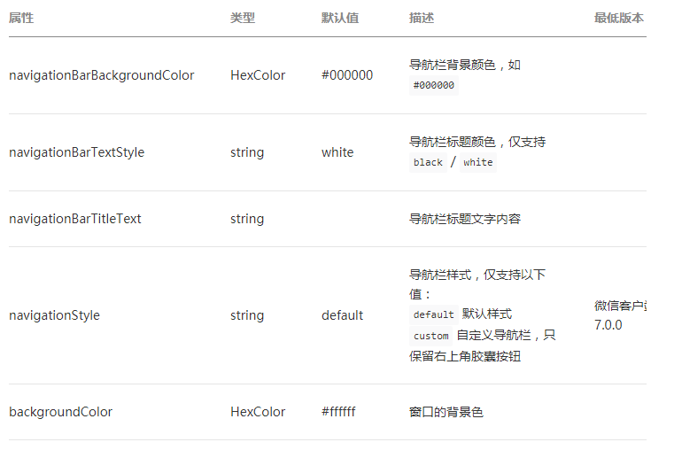
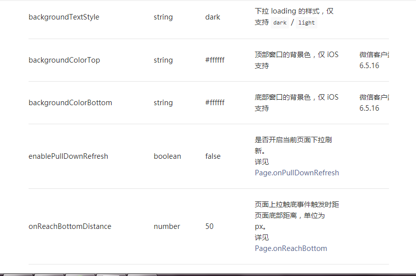
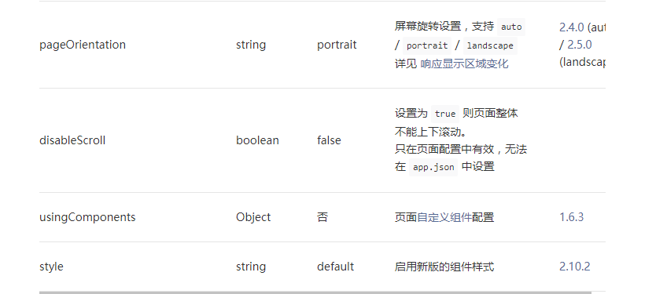
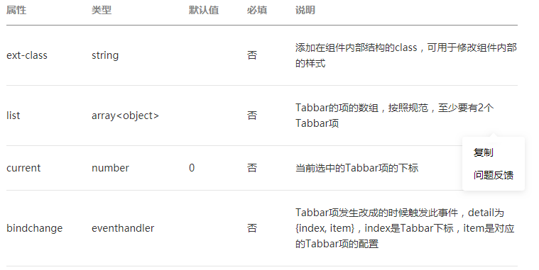
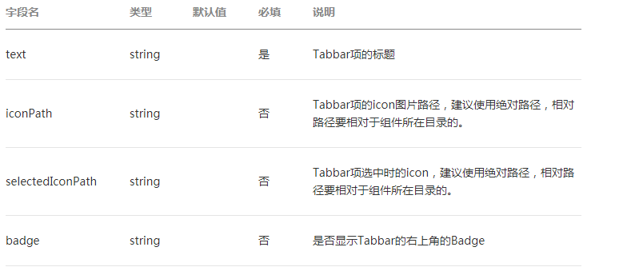

#目录

##1.CMS原型
- 即内容管理系统

###1.1框架结构
- 框架程序主体部分组成
  - 1.app.js
  - 2.app.json
  - 3.app.wxss
###1.2框架页面组成
- 1.wxml
  - 必须使用
  - 作用为页面结构
- 2.wxss
  - 不必须使用
  - 作用为页面样式表
- 3.json
  - 不必须使用
  - 作用为页面配置
- 4.js
  - 必须使用
  - 作用为页面逻辑
- tips:这四个文件必须是相同的路径及文件名

###1.3pages
- 页面
- 新增页面时需要在app.json文件中注册，不然无法跳转到新增页面
- 注册时不需要写文件后缀，系统会自动查找相应后缀

###1.4json配置项列表

|属性|类型|必填|描述|
| :-: |:-:|:-:|:-: |
|pages| StringArray |1|设置页面路径|
|window|Object|0|设置默认页面的窗口表现 (即导航条)|
|tabBar|Object|0|设置底部tab的表现|
|networkTimeout|Object|0|设置网络超时时间|
|debug|Boolean|0|设置是否开启debug模式|

###1.5windows配置项
- 页面配置中只能设置 app.json 中 window 对应的配置项，以决定本页面的窗口表现，所以无需写 window 这个属性。
  
  

###1.6tabBar底部栏
- 配置项
- selectedColor 选中项颜色
- backgroundColor 背景颜色

- list属性是对象数组，每一项表示一个Tabbar项，其字段含义为

###1.7页面的json文件
- 页面的json文件只可以配置window，所以可以不用写window键直接输入属性

##2.添加页面
- 在pages文件中新建文件夹并新建页面
- wxml文件中为网页内容
###2.1添加图片
- < view>< /view>
  - 用于展示的元素，里面可内嵌其他元素，如图像
- < image>< image>
  - 图像元素，可展示图片
  - mode属性为大小,值"cover"为默认大小
  - src属性为图片地址

###2.2用变量替换文本

- 使用格式： < view> {{ message }} < /view>
- 初始化格式： Page({
  data: {  
    message: 'Hello MINA!'  
   }  
})
###2.3使用样式表美化界面
- 于wxss文件中定义样式，格式为：  
.类名 {样式内容}
  - 属性名:
    - font-size，可调整文本字体大小
    - margin-top,可调整与上段文字的距离
    - text-align,调整文本位置
    - text-indent,首行缩进距离设置
    - height，高度
    - width：宽度
##3.CMS文章列表和内容界面
